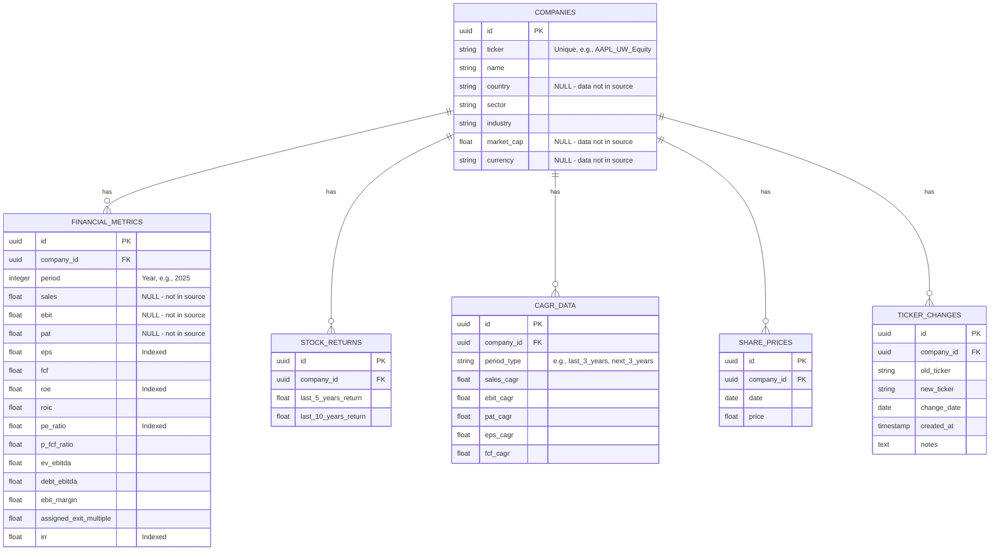

# Financial AI Agent

A full-stack financial analysis platform designed to provide Bloomberg-style stock recommendations based on technical indicators and fundamental data.

## Tech Stack

- **Frontend**: Next.js + Tailwind CSS (planned)
- **Backend**: Python (FastAPI) - Raw SQL, no ORM
- **Database**: PostgreSQL
- **AI**: Google Gemini API for natural language to SQL

---

## Environment Variables

This repo intentionally does **not** commit real `.env` files.

- **Backend**: copy `env.example` → `.env` (in repo root) and fill in values.
- **Frontend**: copy `frontend/env.local.example` → `frontend/.env.local` and fill in values.

Key variables for the “Top IRR (All Companies)” flow:

- `TOP_IRR_LIMIT_DEFAULT` / `TOP_IRR_LIMIT_MAX`: controls how many rows the backend returns (default 25)
- `GPT_BATCH_SIZE`: companies per o3 request (default 50)
- `GPT_MAX_CONCURRENCY`: parallel o3 batch calls (only for `main_gpt_concurrent.py`)
- `NEXT_PUBLIC_TOP_IRR_LIMIT`: default number of rows the UI requests/displays (default 25)

---

## Database Architecture

### Current State
- **503 Companies** from S&P 500 + selected stocks
- **9,715 Financial Metric Records** (2010-2029, annual data)
- **88,831 Share Price Records** (monthly historical prices)
- **0 CAGR/Returns** (tables exist but not yet populated)

### Schema Diagram



### Key Design Decisions

1. **UUIDs for Primary Keys**: Ensures global uniqueness, easier for distributed systems.
2. **INTEGER for Period**: Stores year (e.g., `2025`) instead of full date since source data is annual.
3. **Normalized Schema**: All ticker references require JOIN with `companies` table. This maintains 3NF and ensures data consistency.
4. **Materialized View**: `company_latest_metrics` pre-joins company + latest financial data for dashboard queries.
5. **Audit Trail**: `ticker_changes` table with automatic trigger logs all ticker symbol changes for compliance and debugging.

### Missing Data (Known Limitations)

> [!WARNING]
> The following columns have **100% NULL values** because the source Excel file does not contain this data:
> - `companies.market_cap`, `companies.country`, `companies.currency`
> - `financial_metrics.sales`, `financial_metrics.ebit`, `financial_metrics.pat`
> 
> Filtering by these fields will not work until we source this data from external APIs (e.g., Yahoo Finance, SEC EDGAR).

---

## Deployment

### Prerequisites

- Docker & Docker Compose
- AWS EC2 instance (t3.micro for free tier)

### EC2 Setup (One-Time)

```bash
# Install Docker on Amazon Linux 2023
sudo yum update -y
sudo yum install docker git -y
sudo service docker start
sudo usermod -a -G docker ec2-user

# Install Docker Compose
sudo curl -L "https://github.com/docker/compose/releases/latest/download/docker-compose-$(uname -s)-$(uname -m)" \
  -o /usr/local/bin/docker-compose
sudo chmod +x /usr/local/bin/docker-compose

# Log out and back in, then clone repo
git clone <your-repo>
cd fin-agent
cp .env.example .env
nano .env  # Fill in API keys
```

### Deploy Commands

```bash
./deploy.sh [command]
```

| Command | Description |
|---------|-------------|
| `deploy` | Full deploy: pull → build → migrate → start |
| `up` | Start services (runs migrations first) |
| `down` | Stop all services |
| `restart` | Stop then start |
| `build` | Build Docker images |
| `logs` | View container logs |
| `health` | Check service status |
| `migrate` | Run pending DB migrations |
| `migrate-status` | Show current migration version |
| `rollback` | Undo last migration |

### Database Migrations

Migrations use [golang-migrate](https://github.com/golang-migrate/migrate) format:

```
db_migrations/
├── 000001_setup.up.sql         # Schema
├── 000001_setup.down.sql
├── 000002_db_functions.up.sql  # Functions
└── 000002_db_functions.down.sql
```

Create new migration:
```bash
docker run --rm -v $(pwd)/db_migrations:/migrations migrate/migrate \
  create -ext sql -dir /migrations -seq add_new_feature
```

### Data Upload

Upload Exit Multiple Analysis Excel files via the API:

```bash
curl -X POST http://localhost:8000/api/upload-data \
  -F "file=@Exit Multiple Analysis 1.xlsx"
```

Or use the Swagger UI at `http://localhost:8000/docs`.

**Validation checks:**
- File extension (`.xlsx` or `.xls`)
- Required sheets: `Sector`, at least one metric sheet (EPS, ROE, ROIC, FCFPS)
- Minimum 5 companies in Sector sheet
- Valid year columns (2000-2050)

---